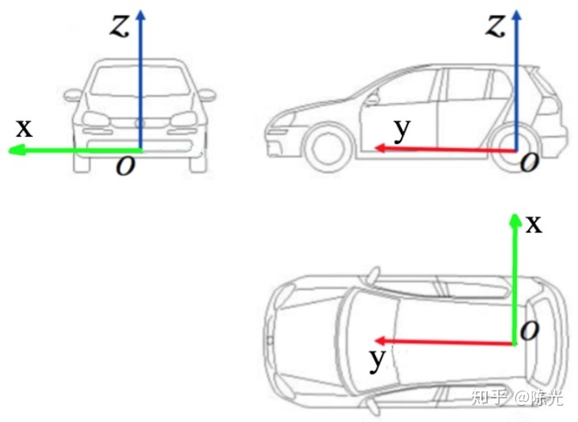

# C-autopolit
自动驾驶笔记

以百度Apollo提供的自车坐标系为例，自车坐标系的定义为：

z轴 – 通过车顶垂直于地面指向上方

y轴 – 在行驶的方向上指向车辆前方

x轴 – 自车面向前方时，指向车辆右侧

## routing 和 planning
**[routing]** - 主要关注起点到终点的长期路径，根据起点到终点之间的道路，选择一条最有路径。
**[planning]** - 主要关注几秒之内汽车的行驶路径，根据当前行驶过程中的交通规则，车辆行人等信息，规划一条短期路径。

routing = planning1 + planning2 + planning3 + ...
